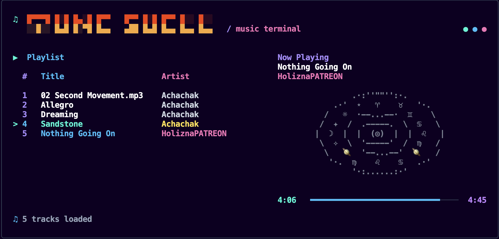

# 🎵 TuneShell — Music Terminal

> A modern, aesthetic CLI music player built with **React Ink** and **Node.js** — play your MP3 library right from the terminal with a beautiful, animated interface.

---

## ✨ What is TuneShell?

TuneShell is a terminal-based music player that brings a premium UI experience directly to your command line. Instead of a plain text interface, TuneShell renders a rich, colorful, split-screen layout using [React Ink](https://github.com/vadimdemedes/ink) — the React renderer for the terminal.

Key highlights:
- **Split-screen layout** — Playlist on the left, animated visualizer on the right
- **Celestial Disc visualizer** — A rotating zodiac/cosmic disc that spins while music plays
- **Live progress bar** — A timeline that tracks playback position in real time
- **Auto-advance** — Automatically moves to the next track when the current one finishes
- **Zero dependencies on external players** — Uses macOS's built-in `afplay` for audio

---

## 🖥️ Interface Overview

<!-- If the image above doesn't render, open a terminal in the project root and run: open assets/TuneShell.png -->

### Left Panel — Playlist
- Lists all `.mp3` files found in the `Songs/` directory
- Highlights the **currently selected** track (`>` cursor) in cyan
- Highlights the **currently playing** track in blue
- Shows track number, song title, and artist (parsed from filename)
- Displays total track count at the bottom

### Right Panel — Now Playing
- Displays the current track title and artist
- Renders an animated **rotating Celestial Disc** (zodiac glyphs) while a track is playing — the disc is dimmed/grey when stopped or paused
- Shows a real-time **progress timeline bar** with elapsed time and total duration

---

## ⚙️ How It Works

### Audio Engine
TuneShell uses macOS's native `afplay` command (via Node's `child_process.spawn`) to play audio. This means:
- **No third-party audio library** is needed
- Audio is played in a **separate child process**
- On stop, the child process receives `SIGKILL`
- On pause, the child process receives `SIGSTOP`; on resume, `SIGCONT`

When a track finishes naturally (exit code `0`), TuneShell automatically advances to the next track in the playlist (looping back to the first track after the last).

### Song Metadata Parsing
Filenames are parsed to extract **Artist** and **Title**. TuneShell expects files in the format:

Artist Name - Song Title.mp3

Common suffixes like `(Official Video)`, `(Lyrics)`, `| Official Music Video`, and `ft. ...` are automatically stripped for a clean display.

Song duration is read using macOS's `afinfo` utility, which queries the audio file's metadata directly.

### Animation Engine
The Celestial Disc is driven by a `frameIndex` state variable that increments every **220ms** via `setInterval`. Each frame cycles through a pre-defined set of zodiac and celestial glyphs (`ZODIAC_SECTORS`) arranged in rotating ring patterns to simulate a spinning disc. The animation starts when playback begins and stops (freezes) when paused or stopped.

### React Ink Architecture
The entire UI is a single React functional component — `TuneShellTerminalApp` — rendered via Ink's `render()`. Key state:

| State              | Description                                      |
|--------------------|--------------------------------------------------|
| `songs`            | Parsed list of all MP3 tracks                    |
| `selectedIndex`    | Currently highlighted row in the playlist        |
| `currentSongIndex` | Index of the track currently being played        |
| `playbackStatus`   | `'PLAYING'`, `'PAUSED'`, or `'STOPPED'`          |
| `frameIndex`       | Current animation frame for the disc visualizer  |
| `elapsedSeconds`   | Seconds elapsed since current track started      |

Keyboard input is handled via Ink's `useInput` hook.

---

## 🚀 Getting Started

### Requirements
- **macOS** (required for `afplay` and `afinfo`)
- **Node.js** v18 or higher
- MP3 files to play

### Installation

1. **Clone the repository:**

   git clone https://github.com/sarthakcontrigit/TuneShell.git
   cd TuneShell

2. **Install dependencies:**

   npm install

3. **Add your music:**
   - Create a `Songs/` directory in the project root (if it doesn't exist)
   - Drop your `.mp3` files into it
   - For best results, name them in the format: `Artist - Song Title.mp3`

4. **Run the player:**

   npm start
   
   # or directly:
   
   node TuneShell.js
 

---

## ⌨️ Keyboard Controls

| Key                | Action                              |
|--------------------|-------------------------------------|
| `↑` / `↓`          | Navigate up/down the playlist       |
| `Enter`            | Play the selected track             |
| `Space` or `P`     | Toggle play / pause                 |
| `N`                | Skip to the next track              |
| `B`                | Go back to the previous track       |
| `S`                 | Stop playback                       |
| `Q` or `Ctrl+C`    | Quit the application                |

---

## 📁 Project Structure

TuneShell/
├── Songs/              # Place your .mp3 files here
├── TuneShell.js        # Main application (React Ink UI + audio engine)
├── package.json        # Project config and dependencies
└── README.md           # You are here

---

## 📦 Dependencies

| Package   | Version   | Purpose                                       |
|-----------|-----------|-----------------------------------------------|
| `ink`     | `^7.1.1`  | React renderer for the terminal               |
| `react`   | `^19.3.0` | Component model and state management          |

> **Note:** `afplay` and `afinfo` are macOS system utilities and do not require installation.

---

## 🎨 Design Philosophy

TuneShell is built around the idea that a terminal application doesn't have to look boring. It uses:
- **Block-font ASCII art** for the TuneShell header logo
- **Neon/cyberpunk color palette** (cyan, violet, pink, sky blue)
- **Animated zodiac disc** as a visual representation of music playing
- **Bold typography** throughout for readability and style

---

## ⚠️ Known Limitations

- **macOS only** — `afplay` is not available on Linux or Windows
- **MP3 only** — only `.mp3` files are scanned from the `Songs/` directory
- **No seeking** — you cannot jump to a specific point in a track
- **Terminal width** — the UI is optimized for a terminal width of ~110 characters; smaller terminals may cause layout issues

---

*Built with ♫ using React Ink and Node.js*
